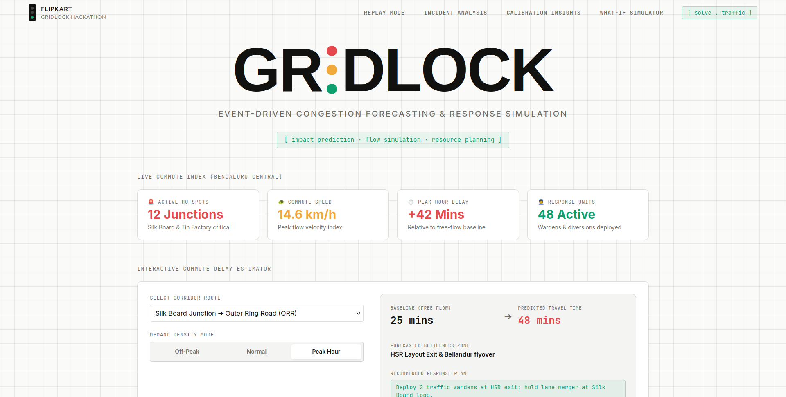
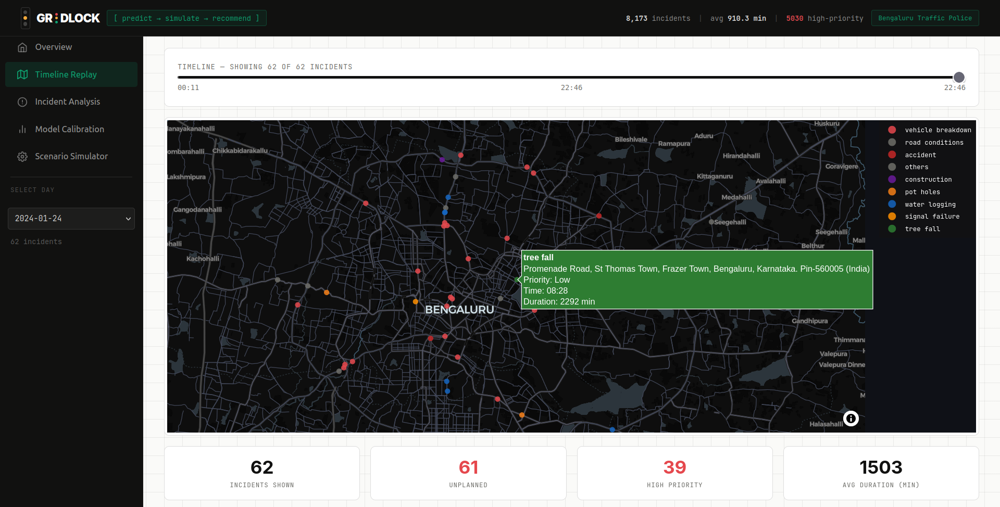
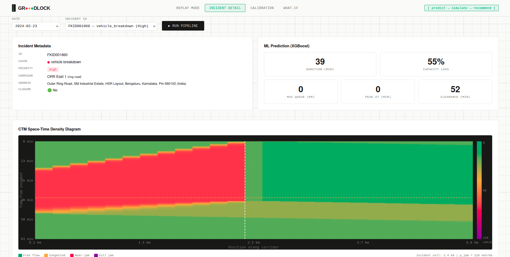
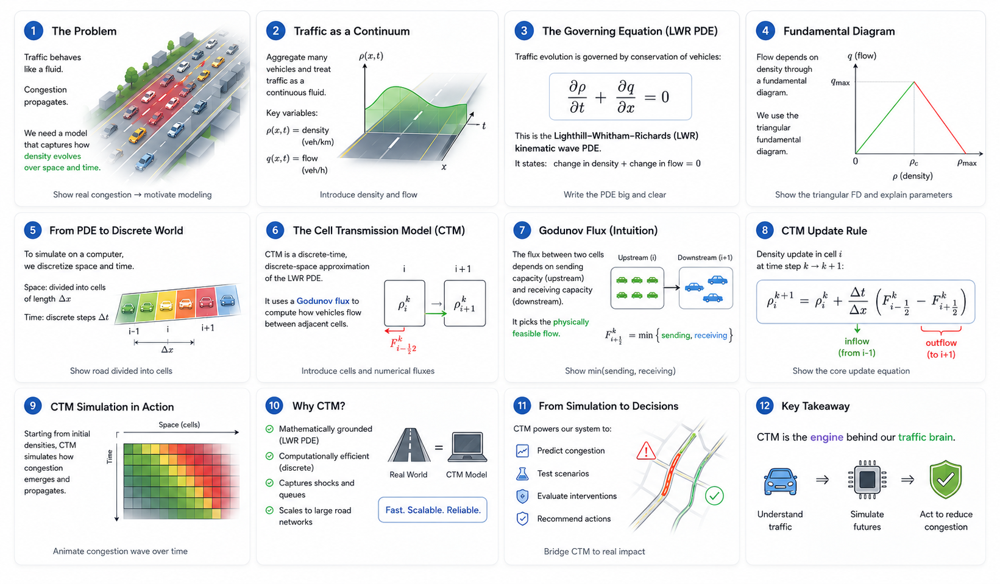

# GR🚦DLOCK BUTTERMASALA
<div align="center">

<br/>

```
 ██████╗ ██████╗   ██╗   ██████╗  ██╗      ██████╗   ██████╗ ██╗  ██╗
██╔════╝ ██╔══██╗  ██║   ██╔══██╗ ██║     ██╔═══██╗ ██╔════╝ ██║ ██╔╝
██║  ███╗██████╔╝  ██║   ██║  ██║ ██║     ██║   ██║ ██║      █████╔╝
██║   ██║██╔══██╗  ██║   ██║  ██║ ██║     ██║   ██║ ██║      ██╔═██╗
╚██████╔╝██║  ██║  ██║   ██████╔╝ ███████╗╚██████╔╝ ╚██████╗ ██║  ██╗
 ╚═════╝ ╚═╝  ╚═╝  ╚═╝   ╚═════╝  ╚══════╝ ╚═════╝   ╚═════╝ ╚═╝  ╚═╝
```

### Event-Driven Congestion Forecasting & Response Simulation

[](https://gridlock-frontend-roan.vercel.app/)
[](https://gridlock-frontend-roan.vercel.app/)
[](https://python.org)
[](https://streamlit.io)

<br/>

> *Bengaluru loses thousands of person-hours daily to traffic incidents.*
> *GRIDLOCK doesn't react to congestion, it forecasts it.*

<br/>

**[→ Try the live demo](https://gridlock-frontend-roan.vercel.app/)**

<br/>

</div>

## The problem

Vehicle breakdowns on the ORR. Tree falls after a monsoon shower. VIP convoys on arterials. Political rallies. Festivals. Construction.

Today, traffic police deploy resources from **experience alone**. No quantified impact forecast, no simulation of how the queue will grow, no post-event learning loop. The same incident on the same corridor at the same time of day produces wildly different response quality depending on who is on shift.

GRIDLOCK closes that gap in three steps.

<br/>

## How it works

```
 INCIDENT REPORT
       │
       ▼
┌─────────────────────────────────────────────────────────────────┐
│  PREDICT                                                        │
│  AI model — trained on resolved Bengaluru incidents             │
│  → predicted duration   → predicted capacity loss               │
└──────────────────────────┬──────────────────────────────────────┘
                           │
                           ▼
┌─────────────────────────────────────────────────────────────────┐
│  SIMULATE                                                       │
│  Cell Transmission Model (CTM) — LWR kinematic wave PDE         │
│  → shockwave space-time diagram  → peak queue length & timing   │
└──────────────────────────┬──────────────────────────────────────┘
                           │
                           ▼
┌─────────────────────────────────────────────────────────────────┐
│  RECOMMEND                                                      │
│  Simulation output → concrete deployment plan                   │
│  → officers required  → barricades  → diversion route           │
└─────────────────────────────────────────────────────────────────┘
```

<br/>


## In Action

| | |
|:---:|:---:|
|  |  |
|  |  |

## Video
[](https://youtu.be/YOUR_VIDEO_ID)

## Quick start

```bash
git clone https://github.com/your-org/gridlock.git
cd gridlock
pip install -r requirements.txt

python src/clean.py
python src/features.py
python src/graph_build.py
python src/forecast_model.py
python src/calibrate.py

streamlit run app/dashboard.py
```

<br/>

## Repository structure

```
gridlock/
├── data/
│   ├── raw/
│   └── processed/
├── reports/
│   ├── data_quality.md
│   ├── calibration_plot.png
│   └── shap_summary.png
├── src/
│   ├── clean.py
│   ├── features.py
│   ├── graph_build.py
│   ├── forecast_model.py
│   ├── ctm_simulation.py
│   ├── calibrate.py
│   └── recommend.py
└── app/
    └── dashboard.py
```

<br/>

## The simulation engine

The core of GRIDLOCK is a real traffic-flow solver, not a heuristic.

We implement the **Cell Transmission Model (CTM)** — the standard discrete-time approximation of the Lighthill–Whitham–Richards (LWR) kinematic wave PDE:

$$\frac{\partial \rho}{\partial t} + \frac{\partial q}{\partial x} = 0$$

Each corridor is divided into 25 cells × 200 m = 5 km. When an incident is reported, the incident cell's capacity drops by the predicted fraction for the predicted duration. The Godunov update rule propagates the density wave backward (upstream), forming a queue that grows until capacity is restored and then dissipates forward.

**Godunov update at each timestep (Δt = 12 s):**

```
S_i  =  min( ρ_i · v_free,  capacity_i )           ← sending function
R_i  =  min( capacity_i,    w · (ρ_jam − ρ_i) )    ← receiving function
y_i  =  min( S_i,  R_{i+1} )                        ← inter-cell flow

ρ_i(t + Δt)  =  ρ_i(t)  +  (Δt / Δx) · ( y_{i−1} − y_i )
```

**Road-type parameters:**

| Road type | v_free | ρ_jam | Capacity |
|:---|:---:|:---:|:---:|
| Ring road (ORR, Bellary Rd) | 60 km/h | 120 veh/km | 1,800 veh/h |
| Arterial (Hosur, Bannerghatta, Magadi, Tumkur, Mysore) | 40 km/h | 140 veh/km | 1,500 veh/h |
| Local / Non-corridor | 25 km/h | 160 veh/km | 900 veh/h |

The output is a **space-time density heatmap** — the shockwave forming upstream of the incident and dissipating after capacity is restored.

<br/>

## ML models

| Model | Target | Algorithm | Training set |
|:---|:---|:---|:---|
| Duration | `duration_minutes` | AI model (log-transformed target) | Resolved incidents with known `closed_datetime` |
| Capacity loss | `capacity_loss_fraction` | AI model | Heuristic label from `requires_road_closure` + `priority` + `event_cause` |

**Top SHAP features** (duration model):

```
hist_avg_duration          ████████████████████  strongest signal
hour_of_day                ████████████████
corridor_incident_7d       █████████████
priority_num               ██████████
event_cause_enc            ████████
```

The `hist_avg_duration` feature is simultaneously the strongest predictor and the mechanism by which the system improves over time — every resolved incident sharpens the next prediction on that corridor.

<br/>

## Dashboard

| Tab | What you see |
|:---|:---|
| **Replay** | Timeline slider steps through a historical day; incidents appear on a map of Bengaluru coloured by cause |
| **Incident detail** | Select any incident → AI prediction + CTM space-time diagram + officer / barricade / diversion plan |
| **Calibration** | Simulated clearance time vs actual duration scatter (R² annotated) + SHAP importance chart |
| **What-if** | Adjust corridor / duration / priority / closure and trigger a live CTM re-run |

<br/>

## Assumptions

Being explicit about assumptions is a scientific strength, not a weakness.

**Synthetic corridor cells** — The dataset contains point coordinates, not road polylines. Each corridor is modelled as a uniform 1-D array of 25 × 200 m cells with the incident at the midpoint. This is standard practice for single-link CTM studies.

**Heuristic capacity-loss label** — No ground-truth sensor data exists for capacity loss. A rule-based label is derived from `requires_road_closure`, `priority`, and `event_cause`, then tuned against observed clearance times in `calibrate.py`. The label logic is fully published in `src/forecast_model.py`.

**Initial density** — Set to 40% of jam density during peak hours (07:00–10:00, 17:00–20:00 IST) and 20% off-peak. Conservative estimate consistent with BBMP corridor surveys. Production replacement: real-time probe-vehicle density or loop detector feeds.

**Dataset composition** — The dataset is dominated by reactive micro-incidents (breakdowns, punctures, potholes). GRIDLOCK generalises by treating every incident as *a capacity drop of estimated magnitude at a network point for a predicted duration* — the physics applies regardless of cause. As planned-event records accumulate, the model's accuracy for those event types compounds automatically.

**Road graph** — Junction connectivity is reconstructed from the `junction` and `corridor` columns of the dataset. Edge lengths are approximated from the coordinate spread of incidents along each corridor. Production would use MapMyIndia polylines and routing APIs.

<br/>

## Tech stack

| Layer | Libraries |
|:---|:---|
| Data | `pandas` · `numpy` · `scikit-learn` |
| ML | `xgboost` · `shap` · `lifelines` |
| Simulation | `scipy` · `numpy` |
| Graph | `networkx` |
| Visualisation | `plotly` · `folium` · `matplotlib` |
| App | `streamlit` |

<br/>

## Partners

<table>
<tr>
<td align="center" width="50%">
<br/>
<b>MapMyIndia</b>
<!-- <br/><br/>
Proprietary mapping technology and localized traffic intelligence — the same infrastructure used across India's navigation, logistics, and urban planning systems.
<br/><br/> -->
</td>
<td align="center" width="50%">
<br/>
<b>Bengaluru Traffic Police · ASTraM</b>
<!-- <br/><br/>
Real-world traffic datasets built from extensive urban traffic analysis and field intelligence. Authentic mobility challenges, real data.
<br/><br/> -->
</td>
</tr>
</table>

<br/>

<div align="center">

Built for the **Flipkart Gridlock Hackathon · June 2026** · Bengaluru

[](https://gridlock-frontend-roan.vercel.app/)

</div>
